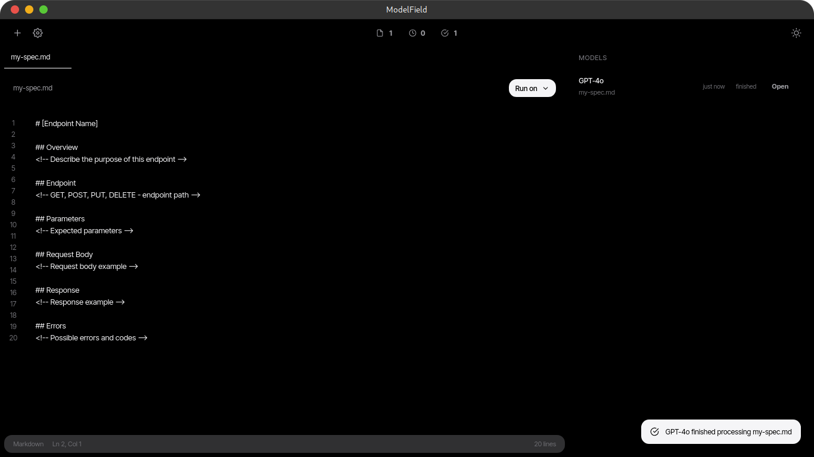
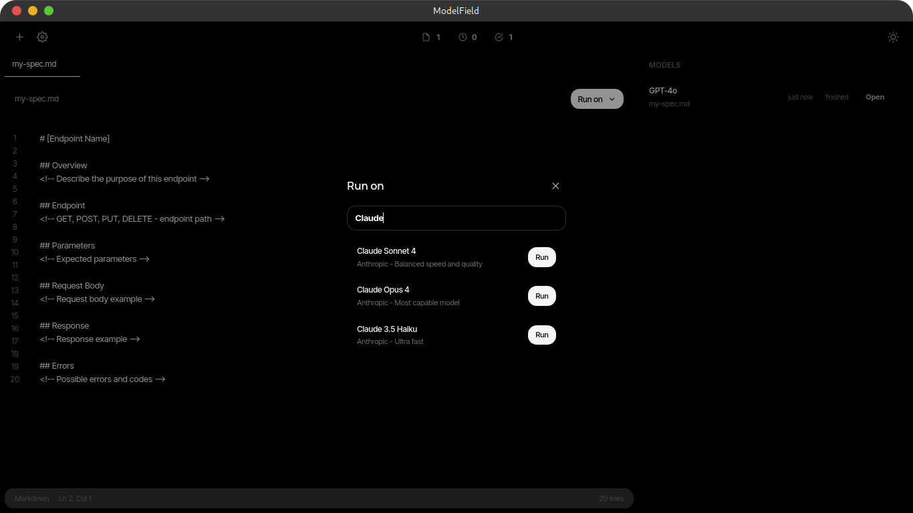
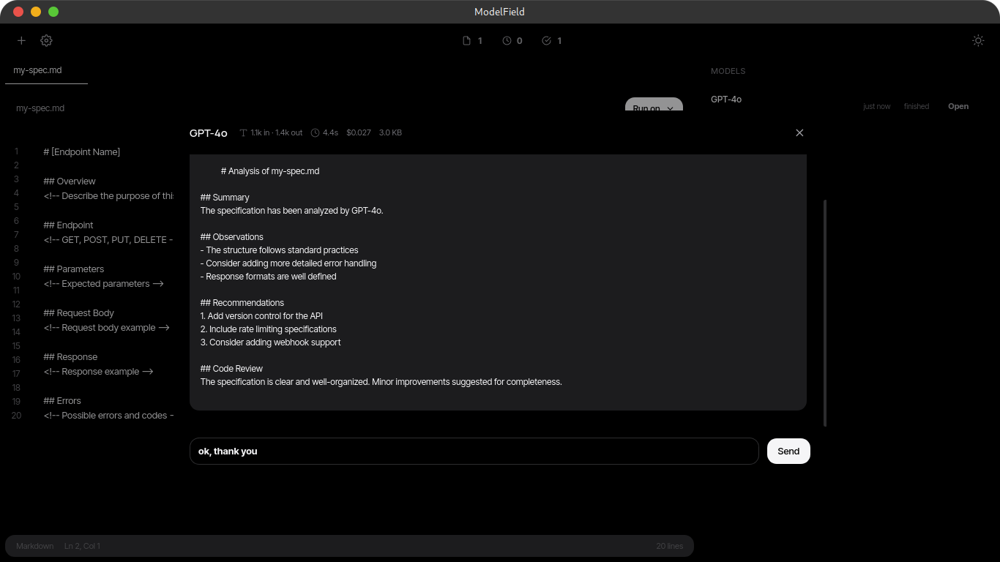

# ModelField

Desktop application for writing, running, and comparing AI model specifications.

## Overview

ModelField is a desktop app that lets you write spec files (markdown) and run them against
multiple AI models side by side. It provides a unified interface for prompt engineering,
model comparison, and result tracking.



## Supported Platforms

- Linux (amd64)
- Windows (amd64)
- macOS (Intel, amd64)

## Supported Models

- OpenAI (GPT-4, GPT-4o, etc.)
- Anthropic Claude (Claude 3.5 Sonnet, Claude 3 Opus, etc.)
- Google Gemini (Gemini 1.5 Pro, Gemini 1.5 Flash, etc.)
- OpenRouter (access to multiple models via single API)

Note: Model integrations are currently mocked. The UI and cost tracking logic were
functional in earlier versions and will be reconnected to live APIs.

## Stack

- **Backend:** Go 1.25, Wails v2
- **Frontend:** Vanilla HTML, CSS, JavaScript (no framework)
- **Build:** Makefile, Docker, GitHub Actions CI/CD
- **Data:** JSON files stored in ~/.modelfield/

## Architecture

### Backend (Go)

- `main.go` -- Application entry point, Wails configuration
- `app.go` -- Core logic: API key management, file persistence, data layer
- Data stored as JSON in the user's ~/.modelfield/ folder

### Frontend (Vanilla JS)

- `app.js` -- State management, Wails bindings detection
- `editor.js` -- Spec editor with line numbers, cursor tracking
- `files.js` -- File CRUD, tabs, context menus
- `models.js` -- Model list, cost calculations, run orchestration
- `modals.js` -- Dialog management
- `notifications.js` -- Toast notifications
- `templates.js` -- Predefined spec templates

## User Workflow

1. Open ModelField
2. Create a new spec file (or use a template)
3. Write the spec in markdown
4. Select models to run against



5. Execute the run -- results appear in a chat modal with metrics



6. Compare outputs, track costs and token usage

## Build

```bash
# Linux (with system dependencies)
make

# Docker (isolated, no local deps needed)
make docker

# Cross-compile for Windows (requires MinGW)
make build-windows

# Full release (build + tag + push)
make release VERSION=1.0.0
```

## Current State

Beta. Core features working:
- Spec file creation, editing, and management
- Model selection and mock execution
- UI with dark/light theme support
- File persistence via Wails backend
- Cross-platform build infrastructure
